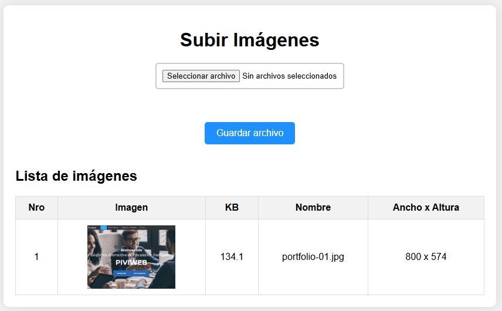

# Sistema de Gestión y Visualización de Imágenes

Esta actividad implementa un sistema web para la subida y visualización de imágenes, desarrollado utilizando tecnologías estándar de desarrollo web como HTML, CSS y PHP. El objetivo del proyecto es facilitar la carga de imágenes y su posterior visualización en una tabla que muestra detalles como el nombre de la imagen, su tamaño y dimensiones.

  

A través de un formulario, los usuarios pueden seleccionar y cargar archivos de imagen.

El formulario soporta múltiples tipos de archivos de imagen gracias al uso de enctype="**multipart/form-data**".

Una tabla dinámica lista todas las imágenes subidas con detalles como el número, vista previa de la imagen, tamaño en KB, nombre del archivo y dimensiones (ancho x altura).

El listado se genera dinámicamente mediante un script PHP que lee el directorio de imágenes y obtiene la información necesaria.

Esta actividad demuestra habilidades en el desarrollo web frontend y backend, incluyendo la gestión de archivos y la generación dinámica de contenido. Es un ejemplo práctico de cómo crear una interfaz de usuario intuitiva para la carga y visualización de archivos, integrando eficientemente tecnologías HTML, CSS y PHP.

**Consulta la versión preliminar de la actividad aquí:** [https://ejercicio_12.com](https://www.alejandrovillegas.dev/projects/exercise-12/index.php)

# 📌 Información de la Actividad

Esta actividad ha sido desarrollado como parte del portafolio de soluciones tecnológicas, con el objetivo de ofrecer una herramienta eficiente y funcional para usuarios autodidactas interesados en la gestión y desarrollo de proyectos web.

- **Área**: Desarrollo de Actividades Web

- **Usuario Final**: TecNM

- **Fecha de Desarrollo**: 09 de diciembre de 2018

- **Portafolio de Proyectos**: [www.alejandrovillegas.dev](https://www.alejandrovillegas.dev)

## 🔧 Guía de Instalación y Configuración de la Actividad

1. Descargue y descomprima el archivo del proyecto en su sistema local.

La actividad ahora está funcionando en su entorno local. 🎉
